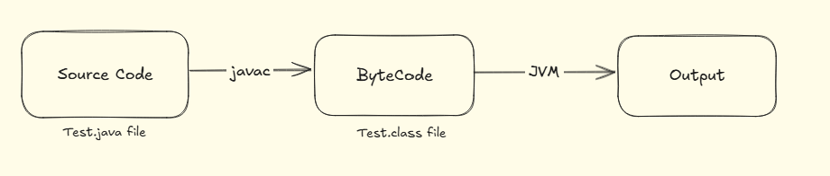
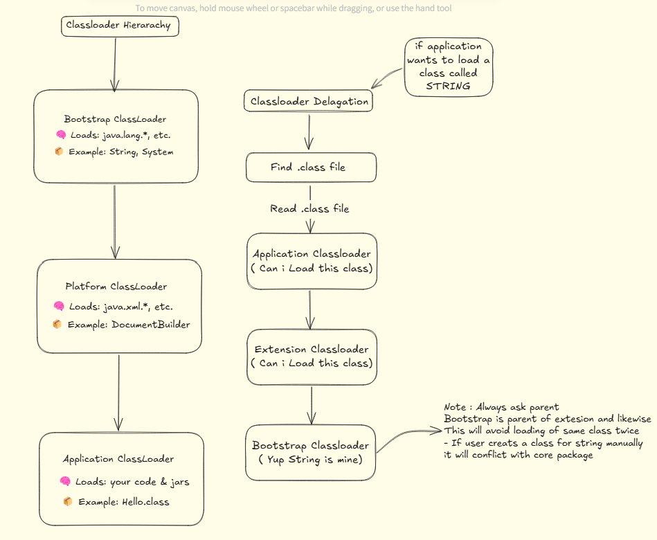

**Basics**

**What is Java & why JAVA**

a) Platform Independant 
- Compiler ( Javac ) converts the code into bytecode and then JVM executes the bytecode generated by the compiler
- Byte code is intermediate code generated by the compiler by the compilation of the java source code
  
  

b) OOPS
- Java is object oriented promoting the use of objects and classes 

c) Security
- Java doesnt have two pointers hence out - of - bound memmory cant be accessed or exploited in java 
- example :-
          - ArrayIndexOutOfBound
          - stack overflow
          - buffer overflow
- also java programs run in an environment that is independent of the os which makes java program more secure 

d) high performance 
- as java has just in time ( JIT ) compiler where the compiler compiles code on demand basis where it only compiles those methods which are called 


**JVM**

- JVM run java application as run time engine 
- JVM is the one that calls that main method present in the java code 
- JVM is part of JRE ( kava runtime environment)
- when we compile a .java file, .class file generate which contains bytecode



**JVM Architecture**

- JVM executes all the class file to generate output 
- Step 1) Class Loader : it basically has 3 steps 
        - Loading 
        - Linking
        - Initialisation


**A) Loading**

i) Bootstrap classloader
- It loads all the core java packages/classes 
- it loads from JDK library which are present in rt.jar or module file 
- example: Scanner(java.utils), System, ArrayList, String

ii) Platform Classloader
- it loads all the packages that are from JDK but non core packages / classes 
- Example:- Anything apart from core and starts frrom java.* or javax.*

iii) Application Classloader / System Classloader
- All .class files we complied from bin or classpath we define or default would the same present directory





B) Linking
- Three steps ok Linking 
  
i) Verification
- it checks the bytecode is safe and valid 
- it checks all the things are right like class format and all the access control
- its like first line of security of JVM
  
ii) Prepration
- it is the phase where JVM allocates memory for all static variables of the class and assigns them default value ( in most cases its 0)
```
public class Test{
  static int x = 5;
  static String name = "Vinay";
}
```
- it will create just the space for all the local variables and give them default value of 0
- for example: in the above example x get its space and value is set to 0 ( default for int)
- space is created for name string and set to null ( default value for string)
- The real value will be assigned in the initialization step 

iii) Resolution
- process where symbolic reference in class are replaced with actual memory reference
- for exmaple:
```
String msg = "HEEEELLLOOO" 
```
- Javac during its compliation it will convert the normal plaint text to its symbolic refernece 
- this is the refernece to class java/lang/String
- this is how javac works ( the package + class ) to indentify its class and defination


**Memory Management**

A) Types of Memory:
- Stack 
- Heap 

Both Stack and Heap are created and managed by JVM and stored in RAM